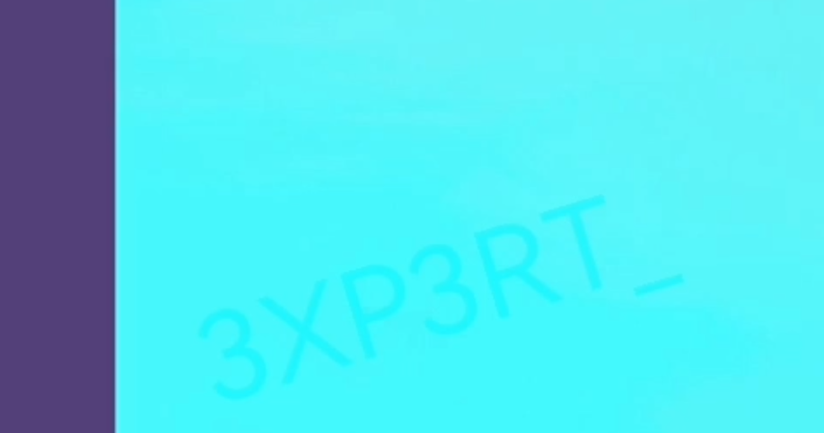
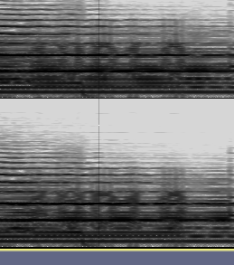

## Challenge Information
**Name**: ButterCup

**Category**: Misc

**Instuction**: To analyze the video and extract the hidden information

## Solution
1. **Analyze video**:

It is given with clues that are 2 hidden text clue and 1 hidden audio clue in the video.

Paying attention on 00:14, the first text is found.
    

Then, alter the video contrast. On 02:52, the second text is found in the dark border.
    

Extract the audio from the video and use Audacity to view the spectrum in grayscale scheme, zoom in the spectrum at 3:10. The third audio clue is found
    

2. **Construct Flag**

Reconstructing the flag using provided format and matching 3 of the clues, the flag is found.