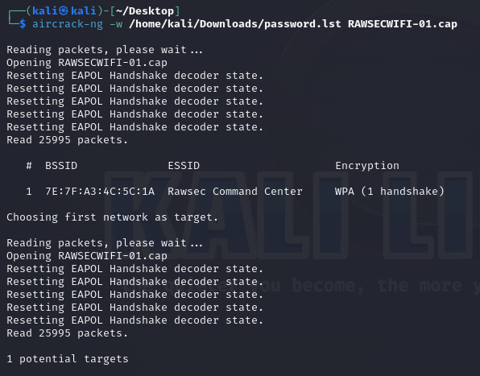
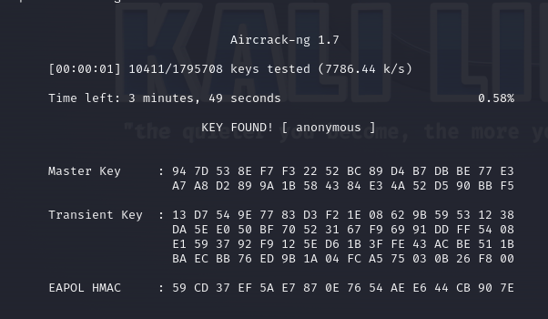

## Challenge Information
- **Name**: LastHope
- **Category**: Networking
- **Instuction**: Use the provided WiFi Packet to crack the WiFi password

## Solution
By using the hint “Have you ever used Aircrack?”.  
The flag should use aircrack to find the wifi password.
And the flag is RWSC{anonymous}







```
└─$ aircrack-ng -w /home/kali/Downloads/password.lst RAWSECWIFI-01.cap

Reading packets, please wait...
Opening RAWSECWIFI-01.cap
Resetting EAPOL Handshake decoder state.
Resetting EAPOL Handshake decoder state.
Resetting EAPOL Handshake decoder state.
Resetting EAPOL Handshake decoder state.
Resetting EAPOL Handshake decoder state.
Read 25995 packets.

   #  BSSID              ESSID                     Encryption

   1  7E:7F:A3:4C:5C:1A  Rawsec Command Center     WPA (1 handshake)

Choosing first network as target.

Reading packets, please wait...
Opening RAWSECWIFI-01.cap
Resetting EAPOL Handshake decoder state.
Resetting EAPOL Handshake decoder state.
Resetting EAPOL Handshake decoder state.
Resetting EAPOL Handshake decoder state.
Resetting EAPOL Handshake decoder state.
Read 25995 packets.

1 potential targets


                               Aircrack-ng 1.7 

      [00:00:01] 10411/1795708 keys tested (7786.44 k/s) 

      Time left: 3 minutes, 49 seconds                            0.58%

                           KEY FOUND! [ anonymous ]


      Master Key     : 94 7D 53 8E F7 F3 22 52 BC 89 D4 B7 DB BE 77 E3 
                       A7 A8 D2 89 9A 1B 58 43 84 E3 4A 52 D5 90 BB F5 

      Transient Key  : 13 D7 54 9E 77 83 D3 F2 1E 08 62 9B 59 53 12 38 
                       DA 5E E0 50 BF 70 52 31 67 F9 69 91 DD FF 54 08 
                       E1 59 37 92 F9 12 5E D6 1B 3F FE 43 AC BE 51 1B 
                       BA EC BB 76 ED 9B 1A 04 FC A5 75 03 0B 26 F8 00 

      EAPOL HMAC     : 59 CD 37 EF 5A E7 87 0E 76 54 AE E6 44 CB 90 7E

```


      
