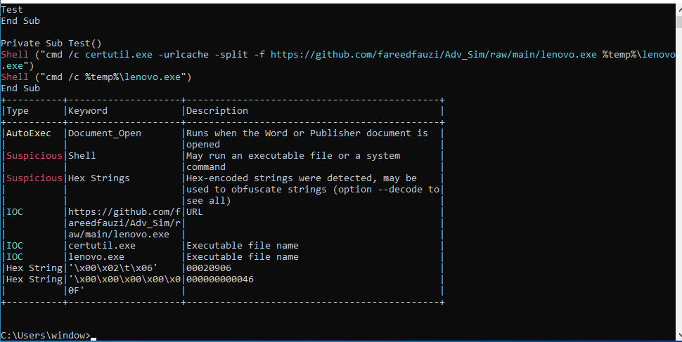
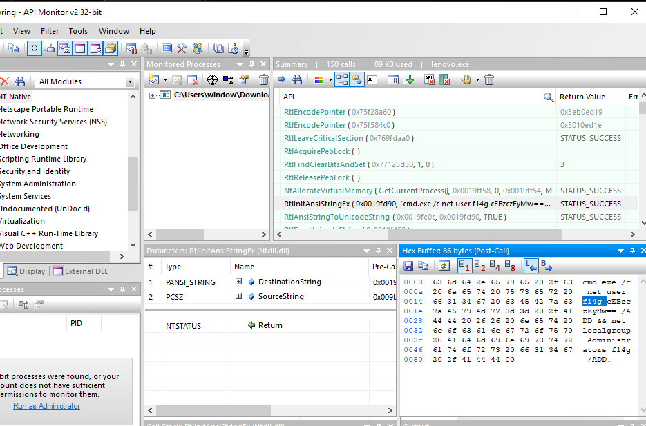

## Challenge Information
- **Name**: Resign letter
- **Category**: Reverse engineering
- **Instuction**: To analyze the zip file which contains mallicious file and extract its password

## Solution
1. **Analysis file**:
    - The file given is in dotm format which indicated an old word document format.
    - It shows that mallicious software is in the file when downloading it.
    - It is suspect that a macro is hidden in the file.
    - Therefore, alovbe is used to analyse the file
    - An suspicious link and executable is found

2. **Analyse link**:
    - Follow the link showned, it will lead to a mallicious file
    - Download it 

3. **Analyse malware**:
    - To analyse the malware activities, API monitor is being used
    - Upon execution, the processes of the malware will showed and there is flag in line11

4. **Decrypt flah**
    - The showing flag is in base64 format and decrypt it, the flag is found