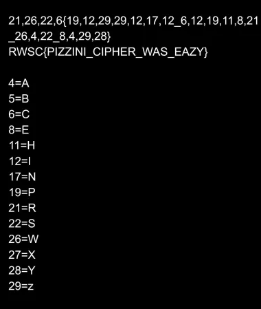

## Challenge Information
**Name**: Round and round

**Category**: Cryptography

**Instuction**: To decrypt the ciphertext

## Solution
1. **Analyze ciphertext**:

The given ciphertext: '2126226{19122929121712_6121911821_26422_842928}' is the flag but crypted.

2. **Analyzing pattern**:

Given format RWSC{}, RWSC = 2126226, assuming each letters represent a digit up to 2 digit, R=21, 26=W, S=22, C=6.

it is true that S come after R which shows 22 after 21, we can see a pattern here.

3. **Decrypt**:

Following the pattern and decrypt, we get the range from 4 to 29 where 4=A, 29=Z, it is proven that there is no single digit 1,2 and 3. 

4. **Flag**:

At last, flag is found
