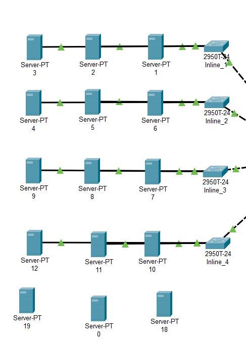
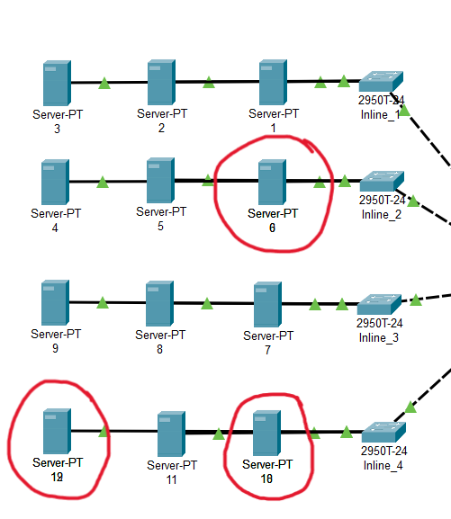

## Challenge Information
**Name**: I Hope You Have The Software

**Category**: Network

**Instuction**: Find the flag in 15 servers (3 server are hidden)

In the provided cisco packet tracer, it have a total of 15 servers and 3 are hidden, which is Server 0, 18 and 19.

And they hid in Server 6, 10, 12

In server 18, the flag is hidden in the service tab in HTTP service.

If click edit the index.html File, it will come out like the image below with a lof of line "I ALWAYS FEEL LIKE SOMEBODY'S WATCHING MEEEEE" and the flag is hidden in the lines.

