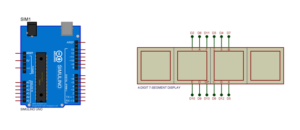
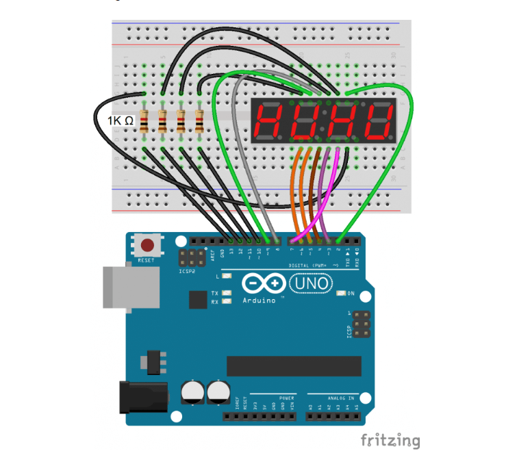
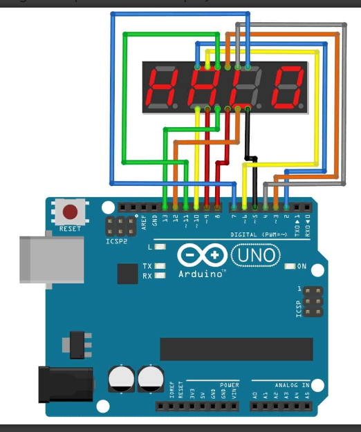
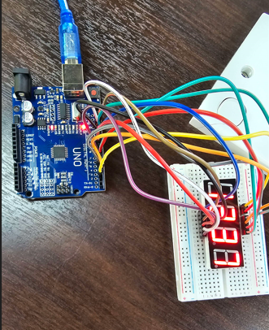
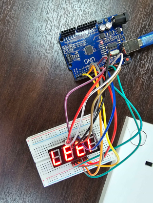

## Challenge Information
**Name**: 7 Segment 4 Digit

**Category**: Hardware 

**Instuction**: To reassemble the 7 segment 4 digit display to show the digit(flag).

## Solution
1. **Analyze device**:

It is given that the devices will have a arduino devices and a 7 segment 4 digit display.

2. **Configuration attempt**:

**Attempt 1**

We first follow the configuration below but we mistaken there is no resistor in the challenge and resulted failure.

**Attempt 2**

By altering some of the wiring and add wires for 5v and GND on the display, we manage to get 1 digit '0' which is fail attempt.

**Attempt 3**

We remove the GND wiring, we manage to get '8880' which we take that as progress but its still a fail attempt.

**Attempt 4**

We found a configuration from web and we replicate it which resulted us for getting the flag.

